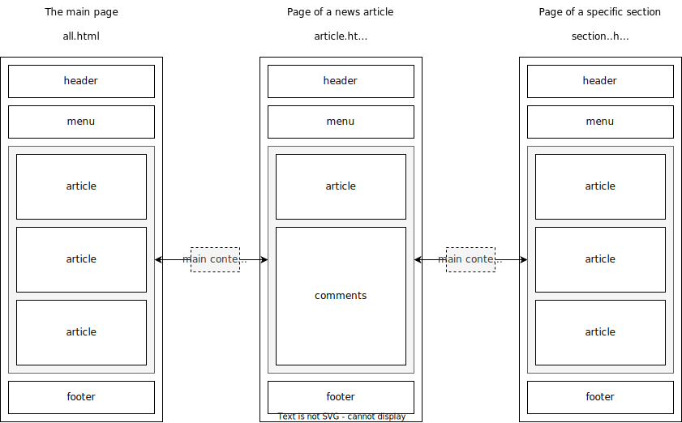
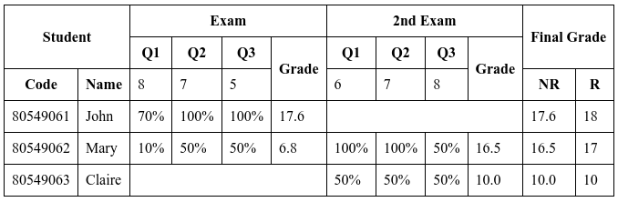

# HTML Exercises

## 1. Online Newspaper

Using **HTML 5 only**, create a **prototype** of an **online newspaper**:

- Throughout this exercise, **do not worry about design**. HTML is a markup language with *pre-defined presentation semantics*; most of the design is handled by CSS (more on this next week).
- For now, you can edit your HTML files locally.
- [Validate](https://validator.w3.org/) and verify the result on the browser as you proceed.

**Some tips and ideas:**

- Use the site <http://www.lipsum.com/> if you need to generate example paragraphs.
- Use the site <https://picsum.photos/> if you need some example photos.

**Instructions:**

1. In this exercise, you will create the pages described in the following image:
   

    - The **main** page represents the main page of the newspaper having a series of **abbreviated** news items.
    - The **news article** page has one particular news item in its **complete** form. It also has comments written by the readers.
    - The **section** page is very similar to the **main** page, but only has news about a particular topic (*e.g.*, sports).

2. For each page, create a new HTML file, open it with your favorite code editor, and add the following basic HTML code:

    ```html
    <!DOCTYPE html>
    <html>
        <head>
            <title>Online Newspaper</title>
        </head>
        <body>
        </body>
    </html>
    ```

3. Open the **main** page in a **web browser** (the most straightforward way is to drag the file into a new tab).

4. Complete each page using the **correct semantic elements**.
    - The **header** of each page should have:
        - The name of the newspaper.
        - A logo.
        - The section's name (if it's a **section** page).
        - Clicking any of these elements should take the user back to the **main** page.
    - The **menu** should have links to each one of the **section** pages (*e.g.*, sports, politics, and local)
        - The links should be part of an unordered list.
        - For now, all of those can point to *section.html*.
    - Each **article** should have a title, some paragraphs, an image, and a footer.
        - In the **main** and **section** pages, only a couple of paragraphs of each news item should be shown.
        - The **news article** page should also have some comments. Each **comment** should have some text, a date/time, and the author's username. After all the comments, there should be a **form** (with a title, a username and a text fields) that allows users to add more comments.
        - The **footer** should contain the date/time and the author's name. In the **main** and **section** pages, there should also be a "Read more" link that redirects the user to the **news article** page containing the complete news item.
    - The footer of each page should have a Copyright Notice. Use a [character entity](https://www.amp-what.com/unicode/search/) for the © symbol.

5. Don't forget to [validate](https://validator.w3.org/) the pages when you're done.

**What did I learn:**

- The basics of HTML documents.
- The usage of section elements.
- How to validate an HTML page.
- HTML is not for design!

## 2. Complex Table

Using **HTML 5 only**, create a document representing the following [table](https://web.fe.up.pt/~arestivo/slides/?s=html5#tables).



As we still don't know CSS, let's use the attribute border= "1" to visualize the result better:

```html
<table border="1">
  <tr>...</tr>
  ...
</table>
```

Or, if you want to be fancy, you can use CSS (**spoiler alert**). Just add this to the document's **head** element:

```html
<style>
table {
   border-collapse: collapse;
}
th, td {
   border:1px solid;
   padding: 0.5em;
}
</style>
```

**Tip:** The easiest way to implement complex tables in HTML is to think about the table row by row. This table has **6 rows**.

**When you are finished:**

1. [Validate](https://validator.w3.org/) the HTML code.
2. Include a [valid HTML 5 icon](https://www.google.com/search?tbm=isch&as_q=html5+valid+icon&tbs=isz:lt) on the webpage.
3. Revalidate the document.

**What did I learn:**

- How to create a complex HTML table.
- Tables are for presenting tabular data, not for design!

## 3. Online

Try putting your code from [exercise 1](https://web.fe.up.pt/~arestivo/page/exercises/html/#1-online-newspaper) online, using FEUP's [webservers](https://web.fe.up.pt/~arestivo/page/exercises/servers).

There have been many changes in the last year, so these instructions might not work very smoothly. If you are having problems with this exercise, don't worry; eventually, we will figure it out.

## 4. Form

1. Create a web page containing a **form** where users should input the following data:
    - Name (text).
    - Age (radio buttons with options "<18", "19-35", "36-48" and ">49")).
    - Profession (text but with some predefined suggestions — use a **datalist**).
    - Country (a dropdown box – add some countries).
    - Interests (a list where users can check several – make up some choices).
    - How did the user find out about the site (larger text field).
2. The *name* and *country* fields should be **required**.
3. The form should also have a submit button, use the **button** element.
4. Each field should have a **label**.
5. [Validate](https://validator.w3.org/) the page when you are finished.
6. Try to submit the form and verify what happens in the URL bar using **POST** and **GET** as the form methods.

**What did I learn:**

- How to create an HTML form.
- How to use labels to improve accessibility.
- How to use character entities.
- The difference between "GET" and "POST" action in forms (more about this later).

## 5. Extra

1. Pick a page from a website you use a lot
2. Without looking at its HTML code, try writing your own version using good HTML semantics.
3. [Validate](https://validator.w3.org/) the HTML code.
