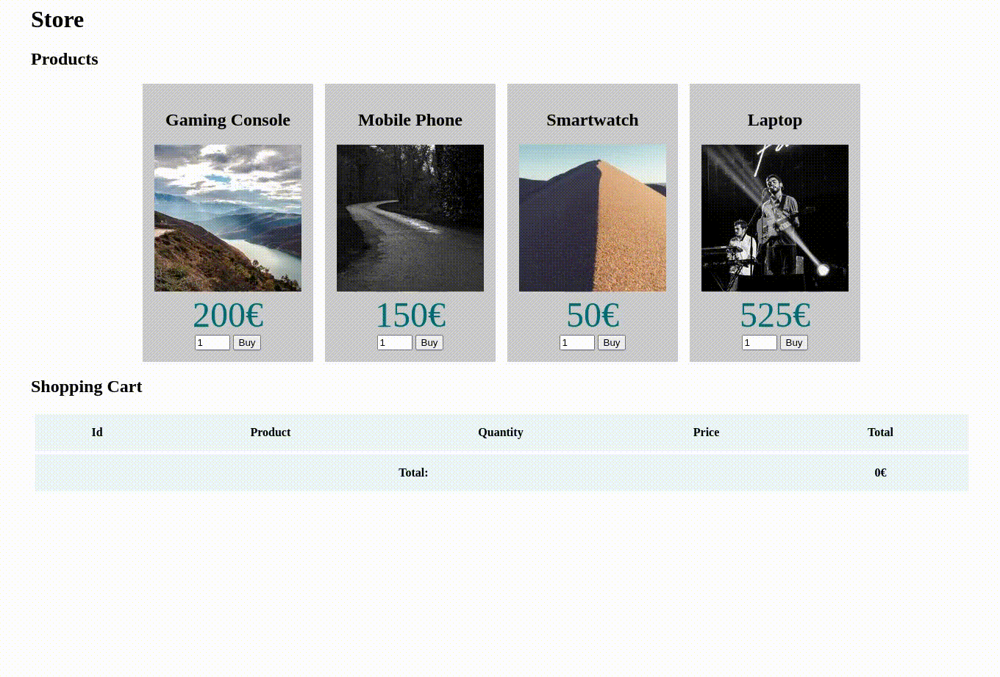
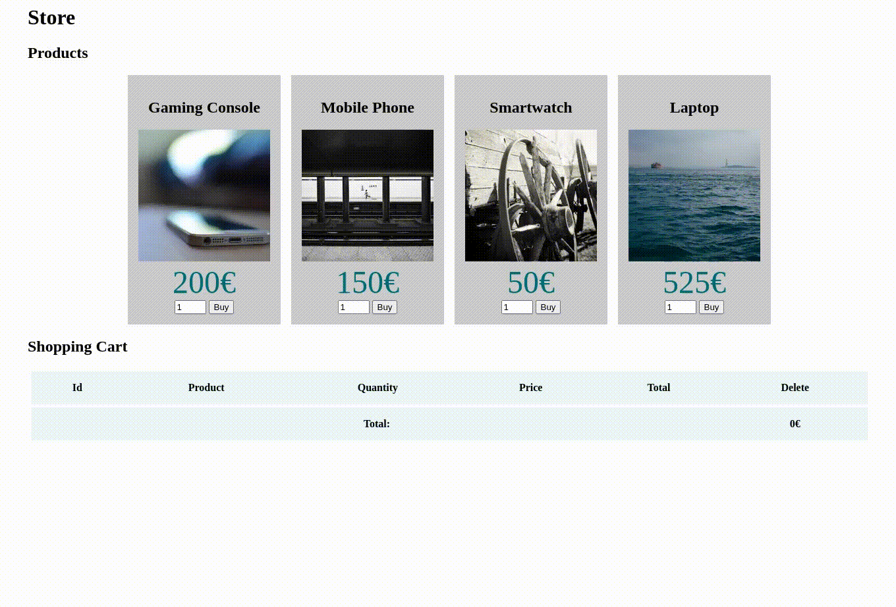

# JavaScript Exercises

## 1. Hello World

1. Download the following [zip file](javascript.zip), **uncompress** it into a folder, and start a **webserver** inside that folder:

    ```console
    php -S localhost:9000
    ```

2. Notice that the zip contains three files:

   - An **HTML** file with two sections (products and cart).
   - A **CSS** file with some pre-defined styles.
   - An empty **JavaScript** file.

3. Notice how the HTML file imports the JavaScript file:

    ```html
    <script src="script.js"></script>
    ```

    **Important:** The script tag must always be closed.

4. Open your [developer console](https://balsamiq.com/support/faqs/browserconsole/).

5. Add the following code to the *script.js* file:

    ```js
    console.log('Hello World')
    ```

6. **Reload** the page and watch the **output** on your browser's **console**.

**What did I learn:**

- How to run *JavaScript* code stored in a different location.
- The *script* tag must **always** be closed.
- How to write to the developer *console*.

## 2. Selecting Elements

1. **Delete** the code in *script.js* from the previous exercise; we do not need it anymore.

2. Create a new [function](https://developer.mozilla.org/en-US/docs/Web/JavaScript/Guide/Functions) called `changeAllArticleColors()`.

3. Inside that function, use the [`querySelectorAll()`](https://developer.mozilla.org/en-US/docs/Web/API/Document/querySelectorAll) function to **select all** *articles* inside the *#products section* and assign the result to a **constant**.

4. Use a [for ... of](https://developer.mozilla.org/en-US/docs/Web/JavaScript/Reference/Statements/for...of) loop to loop over the articles you selected.

5. For each article, use the [classList](https://developer.mozilla.org/en-US/docs/Web/API/Element/classList) property, and its [`add()`](https://developer.mozilla.org/en-US/docs/Web/API/DOMTokenList/add) function to add a *"sale"* class to those elements.

6. **Change** the *style.css* file so that *articles* inside the *#products section* having class *sale*, have a different [background color](https://developer.mozilla.org/en-US/docs/Web/CSS/background-color) (*e.g.*,  #ffddd2).

7. **Call** the `changeAllArticleColors()` function like this:

    ```js
    function changeAllArticleColors() {
        // ... function body
    }

    changeAllArticleColors()
    ```

    - Notice that this **will not work**; the class *sale* will not be added to all articles (you can check by opening the elements' tab in the developer console).

    - This happens because the script **executes** as soon as the *script* tag appears in the HTML code (*i.e.*, before all HTML content is parsed and rendered by the browser).

    - One way to **fix** this is to use the [defer](https://developer.mozilla.org/en-US/docs/Web/HTML/Element/script#attr-defer) attribute on the *script* tag:

        ```html
        <script src="script.js" defer></script>
        ```

    - This will make the browser keep loading, parsing, and rendering the HTML; and *defer* the execution of the script to the **end** of this process.

    - An **alternative** way would be to call the function from a [window load event](https://developer.mozilla.org/en-US/docs/Web/API/Window/load_event):

        ```js
        window.addEventListener('load', function() {
            changeAllArticleColors()
        })
        ```

    - But using the *defer* attribute is still **preferred**.

**What did I learn:**

- How to write a *JavaScript* function.
- How to use `querySelectorAll` to select HTML elements.
- How to loop over array-like objects using `for ... of`.
- How to use the `classList` property to add a class to an HTML element.
- Normally, we want *JavaScript* code to run after the HTML page is loaded.
- How to use the `defer` attribute to make sure this happens.

## 3. Events

1. **Delete** the code in *script.js* from the previous exercise; we do not need it anymore.

2. Create a new [function](https://developer.mozilla.org/en-US/docs/Web/JavaScript/Guide/Functions) called `attachBuyEvents()`.

3. **Call** the `attachBuyEvents()` function like this:

    ```js
    function attachBuyEvents() {
        // ... function body
    }

    attachBuyEvents()
    ```

4. Inside that function, select all buttons in the *products section* and use the [`addEventListener`](https://developer.mozilla.org/en-US/docs/Web/API/EventTarget/addEventListener) method to attach a [click event](https://developer.mozilla.org/en-US/docs/Web/API/Element/click_event) to **each one** so that when the user clicks the button, another function is called (this can be an anonymous function). **For example:**

    ```js
    button.addEventListener('click', function() {...function code goes here...})
    ```

5. Make the function responding to the *buy* events print **'BUY!'** in the console; test it.

6. Make the function responding to the *buy* events print the **event target** in the console; test it.

    - One way of doing it is to add a parameter to the function that receives an [Event](https://developer.mozilla.org/en-US/docs/Web/API/Event) object:

        ```js
        function(e) {
            console.log(e.currentTarget)
        }
        ```

    - The other is to print *this*:

        ```js
        function() {
            console.log(this)
        }
        ```

7. Hover your mouse pointer over the element printed in the console. You should see the clicked button light up on the web page.

**What did I learn:**

- How to attach events to HTML elements.
- How to access the event that was fired using a parameter in the event handler function.
- How to access the element that fired the event using *this* or *event.target*.

## 4. Attributes

1. Continue with the code from the previous exercise, but delete the code inside the function that responds to buy events.

2. Using the [`parentElement`](https://developer.mozilla.org/en-US/docs/Web/API/Node/parentElement) property, make the function print the article that is the parent of the clicked button in the console; test it.

3. Using the [`classList`](https://developer.mozilla.org/en-US/docs/Web/API/Element/classList) property, and its [`toggle()`](https://developer.mozilla.org/en-US/docs/Web/API/DOMTokenList/toggle) function, add/remove a *"sale"* class to the parent of the clicked button; test it, the article containing the clicked button should change color.

4. Using the [`getAttribute()`](https://developer.mozilla.org/en-US/docs/Web/API/Element/getAttribute) method, get the value of the `data-id` attribute of the article and print it in the console.

    **Note:** [Data-* attributes](https://developer.mozilla.org/en-US/docs/Learn/HTML/Howto/Use_data_attributes), like `data-id`, allow us to store extra information on HTML elements.

5. Find a way to also print the name of the product, its price, and the chosen quantity.

    - You can use the [`querySelector()`](https://developer.mozilla.org/en-US/docs/Web/API/Document/querySelector) method to search for an element inside another element.
    - You can use the [`textContent`](https://developer.mozilla.org/en-US/docs/Web/API/Node/textContent) to get the text inside each one of the elements.
    - You can use the `value` attribute to get the value of an [`HTMLInputElement`](https://developer.mozilla.org/en-US/docs/Web/API/HTMLInputElement).

**Final Result:**



**What did I learn:**

- How to use the `parentElement` attribute to navigate up the DOM tree.
- How to use the `classList` property to access and change HTML element classes.
- How to use the `getAttribute` method to access HTML element attributes.
- What are `data-*` attributes, and how to use them to store values.
- How `querySelector` and `querySelectorAll` also work on HTML elements.
- How to use `textContent` and `value` to access text from elements and values from input fields.

## 5. Creating Elements

Continue the previous exercise, but instead of writing the product data to the console, we will add a new row to the table inside the *cart section*:

1. In the function that handles clicks on the buy buttons, use the [`createElement`](https://developer.mozilla.org/en-US/docs/Web/API/Document/createElement) method to create a new row. Use the [`appendChild`](https://developer.mozilla.org/en-US/docs/Web/API/Node/appendChild) to insert the row into the table.

2. After creating the row, use the same method to create data cells for each row in the table (id, name, quantity, price, and total). Use the [`appendChild`](https://developer.mozilla.org/en-US/docs/Web/API/Node/appendChild) to insert these data cells into the row.

3. Change the content of each cell, using [`textContent`](https://developer.mozilla.org/en-US/docs/Web/API/Node/textContent), to reflect the chosen product and quantity. To calculate the total, you can use [`parseInt`](https://developer.mozilla.org/en-US/docs/Web/JavaScript/Reference/Global_Objects/parseInt) to transform a string into a number.

4. If a row with the same id already exists in the cart, update the row's values instead of adding a new row.

5. Add a link on each row to delete that row from the cart; make this link work using the [`remove`](https://developer.mozilla.org/en-US/docs/Web/API/Element/remove) method.

6. Make sure the cart's total stays updated when new rows are added or deleted.

**Final Result:**



**What did I learn:**

- How to use the `createElement` method to create new HTML elements.
- How to use the `appendChild` method to append HTML elements as children of other HTML elements.
- How to use the `textContent` method to change the text content of an HTML element.
- How to use `parseInt` to transform text into numbers.
- How to use the `remove` method to remove elements from the DOM.
