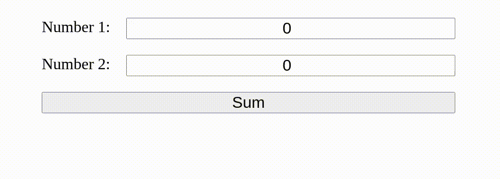

# PHP Exercises

## 0. Environment Setup

Before we start, we will have to setup an environment where we can deploy PHP code.

This should already be set up in your classrooms' computers if you use Linux.

### 0.1 Install PHP and SQlite

- In **Windows**:
  1. Open *PowerShell* **as an administrator**.
  2. Run 'wsl --install' to install [Windows Subsystem for Linux](https://docs.microsoft.com/en-us/windows/wsl/install).
  3. Reboot.
  4. Open PowerShell normally and run 'wsl'.
  5. Run 'sudo apt-get install php-cli sqlite3 php-sqlite3 unzip wget'.

  ```console
  wsl --install
  # reboot
  wsl
  sudo apt-get install php-cli sqlite3 php-sqlite3 unzip wget
  ```

- In **macOS**:
  1. Install [Homebrew](https://brew.sh/).
  2. Run 'brew install php'.
- In **Linux**:
  1. Run: 'sudo apt-get install php-cli sqlite3 php-sqlite3 unzip wget'.

### 0.2 Check if everything is working

In windows you have to open a PowerShell and run 'wsl' first.

1. Run 'php --version'. Version >= 7.4 is fine.
2. Run 'sqlite3 --version'. Any version should be fine.
3. Download the [test project](https://web.fe.up.pt/~arestivo/page/exercises/php/test.zip) into any folder.
4. Open a command line (in Windows, use PowerShell and run 'wsl') and change directory into that folder.
5. Run 'sqlite3 -init example.sql example.db' to create and populate the database.
6. Run 'php -S localhost:9000' to start a development server.
7. In your browser, check '<http://localhost:9000>'. You should see a list of names in an HTML table.

Or just **run** this inside an empty folder:

```console
php --version
sqlite3 --version
wget "https://web.fe.up.pt/~arestivo/page/exercises/php/test.zip"
unzip test.zip
sqlite3 example.db < example.sql
php -S localhost:9000
```

## 1. HTTP Parameters

1. Inside an empty folder, create a script called **sum2.php** that receives two numbers (**num1** and **num2**) as arguments and prints the sum of those two numbers:\
  **Hint**: To access the arguments, you should use the special **$_GET** array.
2. On the command line, run `php -S localhost:9000` inside that same folder to start a new webserver.
3. You can now test your page by going to <http://localhost:9000/sum2.php?num1=2&num2=5>.
4. Make sure the output of your script is valid HTML.
5. Create a new HTML file, called **form2.html**, containing a form asking for two numbers.\
  **Note**: Make that form send the numbers to the script you created previously.
6. Modify the PHP file to contain a link back to the form.



## 2. SQLite Database creation

1. If you haven't done it already, stop the webserver from the previous exercise (Ctrl-C).
2. Create a new folder.
3. Copy the [news.sql](https://web.fe.up.pt/~arestivo/page/exercises/php/news.sql) file into that folder.
4. This file contains a SQL script that creates a new database.\
  Open the file and see if you can understand what it does.
5. Create a new database inside the folder using the command:

   ```console
   sqlite3 -init news.sql news.db
   ```

6. After this last command, the *SQLite* interface will become active.
   To verify if the database has been created correctly, try some SQL commands:

   ```sql
   select * from news where id = 4;
   select * from comments where news_id = 4;
   ```

7. To exit from the *SQLite* interface type:

   ```sql
   .exit
   ```

8. Verify if a new file called **news.db** has been created using the command:
9. To go back to the *SQLite* interface and interact with the new database type:

   ```console
   sqlite3 news.db
   ```

## 3. Listing data from SQLite

1. In the same folder where you created the database, create a new PHP file, called *index.php*.
2. Run `php -S localhost:9000` to start a new webserver.
3. Open <http://localhost:9000/> in your browser.\
  As expected, you should be seeing an empty page.
4. In *index.php*, open a connection to the database using the following PHP code:

   ```php
   <?php
     $db = new PDO('sqlite:news.db');
   ?>
   ```

5. The **$db** variable now represents your connection to the database:
6. Execute a query returning all news in the database using the following code:

   ```php
     $stmt = $db->prepare('SELECT * FROM news');
     $stmt->execute();
     $articles = $stmt->fetchAll();
   ```

7. The variable **$articles** is now an associative array containing all the news in the database. You can iterate over this array using:

   ```php
     foreach( $articles as $article) {
       echo '<h1>' . $article['title'] . '</h1>';
       echo '<p>' . $article['introduction'] . '</p>';
     }
   ```

8. Verify the result in <http://localhost:9000/>.

## 4. Complete Page

1. Using your recently acquired PHP superpowers, change the **index.php** script to create a page like the one we used in the first **CSS exercise** (download the [solution](https://web.fe.up.pt/~arestivo/page/solutions/css) for a faster start).
2. This time, we will get the news from the **database** instead of them being **hard-coded**.
3. You can use the following SQL to get all the information about each article:

   ```sql
   SELECT news.*, users.*, COUNT(comments.id) AS comments
   FROM news JOIN
        users USING (username) LEFT JOIN
        comments ON comments.news_id = news.id
   GROUP BY news.id, users.username
   ORDER BY published DESC
   ```

4. You can use to [date](https://www.php.net/manual/en/function.date.php) function to format a date in [epoch/unix time](https://en.wikipedia.org/wiki/Unix_time) format. For example:

   ```php
     $date = date('F j', $article['published']);
   ```

5. You can use the [explode](https://www.php.net/manual/en/function.explode.php) function to split a string by a separator. For example:

   ```php
     $tags = explode('.', $article['tags']);
   ```

6. Do not forget to verify if the page returns valid HTML code.
7. Also create a new page, called **article.php** that receives a parameter **id** containing the *id* of an article in the database. This page should be able to present that article and its comments.
8. Use the following code to get the article information:

   ```php
     $stmt = $db->prepare('SELECT * FROM news JOIN users USING (username) WHERE id = :id');
     $stmt->bindParam(':id', $_GET['id']);
     $stmt->execute();
     $article = $stmt->fetch();
   ```

   or:

   ```php
     $stmt = $db->prepare('SELECT * FROM news JOIN users USING (username) WHERE id = ?');
     $stmt->execute(array($_GET['id']));
     $article = $stmt->fetch();
   ```

9. And this to get the comments:

   ```php
     $stmt = $db->prepare('SELECT * FROM comments JOIN users USING (username) WHERE news_id = ?');
     $stmt->execute(array($_GET['id']));
     $comments = $stmt->fetchAll();
   ```

10. Create links from the **index.php** page to the **article.php** page in the correct places.
11. Validate both pages.

## 5. Data layer separation

1. Create a new folder called **database** and a new file called **connection.php** inside that folder.
2. Copy the code used to initialize the database connection into the new file inside a *getDatabaseConnection()* function.
3. Replace the initialization code in all pages with a **require_once** instruction (including the newly created file) and a call to the new function.
4. Inside the same folder, create a file called **news.php**. This file will be responsible for all accesses to the **news** table.
5. Inside this file, create a function called **getAllNews** that receives the database connection, queries the database, and returns an array with all the news.
6. Replace any code where all articles are retrieved with calls to this new function.
7. The initial PHP code in your **index.php** should now look like this:

   ```php
   <?php
     require_once('database/connection.php');
     require_once('database/news.php');
   
     $db = getDatabaseConnection();
     $articles = getAllNews($db);
   ?>
   ```

8. Do the same changes to your *article.php* page.
9. Replace all database connection code with a call to *getDatabaseConnection()*, and all queries by calls to functions defined in the **news.php** file.
10. Functions related to the comments table should be created in a new file called **comments.php** in the **database** folder.
11. In the end, move the *news.sql* and *news.db* files to this new folder.

## 6. Presentation layer separation

1. All pages in this example start and end with the same HTML code.
2. Inside a file called **templates/common.php** (create the new folder first), create two functions (*output_header()* and *output_footer()*) that output that code.
3. Replace that code in **both** pages (*index.php* and *article.php*) by calling these two functions.

   Notice that you can output HTML code inside a PHP function very easily. Example:

   ```php
   <?php function print_header($title) { ?>
     <h1><?=$title?></h1>
   <?php } ?>
   ```

4. For more specific HTML code, create new files in the templates folder called, for example, **news.php**, **comments.php**.
5. Create functions that output a list of articles, and a single article (with and without the comment section).
6. Replace that code in **both** pages by calling these new functions.
7. The **index.php** page should now look like this:

   ```php
   <?php
     require_once('database/connection.php'); // database connection
     require_once('database/news.php');       // news table queries
   
     require_once('templates/common.php');    // common templates
     require_once('templates/news.php');      // news templates
   
     $db = getDatabaseConnection();           // connect to database
     $articles = getAllNews($db);             // get articles from database
   
     output_header();                         // output page header
     output_article_list($articles);          // output list of articles
     output_footer();                         // output page footer
   ?>
   ```

8. Notice that you can call other template functions from inside a template function to simplify your code. For example:

   ```php
   <?php function output_article_list($articles) { ?>
     <section id="news">
       <?php foreach($articles as $article) output_article($article); ?>
     </section>
   <?php } ?>
   ```

9. Move all the css files into a **css** folder.
10. From this point forward, all pages should be written using this format.

## 7. Editing data

1. Create a new page called **edit_article.php** that contains a form with 3 fields: **title**, **introduction** and **fulltext**.
2. Use an input with type text for the first one and textareas for the other two. Also add a submit button.
3. This page should receive a parameter called **id** containing the id of the article to be edited.
4. Add a hidden input field containing this **id**.
5. Retrieve the article to be edited from the database and fill the fields with its values.
6. Add a link in the **article.php** file that points to this new page.
7. The action of this new form should point to a new page called **action_edit_news.php**.
8. This new page should receive the four values (id, title, introduction and fulltext) and update the news table with them.\
   Don't forget to separate this code into the **database/news.php** file.
9. This new action page should not print any HTML. Instead, it should redirect the user back to the **article.php** page, sending the correct **id** as a parameter.

## 8. Authentication

1. Create a new page called **login.php** asking for a username and a password in a form.
2. This new form should send the data (username and password) to a **action_login.php** page.
3. In this new page start by initiating the session, verifying if the username and password are correct and, if they are, storing the username in the session. In the end redirect back to the page you came from. Something like this:

   ```php
   <?php
     session_start();                                         // starts the session
   
     require_once('database/connection.php');                 // database connection
     require_once('database/users.php');                      // user table queries
   
     if (userExists($_POST['username'], $_POST['password']))  // test if user exists
       $_SESSION['username'] = $_POST['username'];            // store the username
   
     header('Location: ' . $_SERVER['HTTP_REFERER']);         // redirect to the page we came from
   ?>
   ```

4. Add a **session_start** in all pages so you can access the current user easily in *$_SESSION\['username'\]*.
5. Change the header template so that if the *$_SESSION* array contains a valid user, it will have *logout* link pointing to **action_logout.php** (instead of the *login* and *register* links).
6. Create this page to destroy the session and redirect back to the previous page.
7. Change the **article.php** page so that the link to edit news only appears if a user is logged in.
8. Change the **edit_article.php** and **action_edit_article.php** pages so that if a user is not logged in, they will redirect back to the main page.

## 9. Insert and Delete

1. Create pages and actions to insert and delete articles.
2. Create actions to insert comments.
